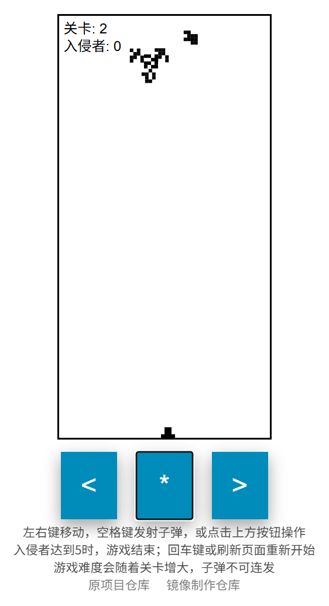

# InvaderZ 入侵者Z

InvaderZ is like the game Space Invaders, except InvaderZ uses the [genetic algorithm](https://en.wikipedia.org/wiki/Genetic_algorithm) to mutate the invaders as you play.  
《入侵者Z》类似于经典游戏《太空侵略者》，不同之处在于，《入侵者Z》在你玩游戏的过程中使用 遗传算法 来让入侵者发生变异。


If you want to see a live version of it, it's hosted [here](https://victorribeiro.com/invaderz).  
如果你想查看这个游戏的在线版本，它托管在 这里。

备用链接 [Alternative link](https://victorqribeiro.github.io/invaderz).

You can also add it as an app to your phone (menu / add to home screen), if you wish so.  
如果你愿意的话，你也可以将它作为应用程序添加到你的手机上（菜单 / 添加到主屏幕）。

## 部署说明

首先感谢原作者的开源。[原项目地址](https://github.com/victorqribeiro/invaderz)

具体汉化了那些内容，请参考[翻译说明](./翻译说明.md)。


有需要帮忙部署这个项目的朋友,一杯奶茶,即可程远程帮你部署，需要可联系。  
微信号 `E-0_0-`  
闲鱼搜索用户 `明月人间`  
或者邮箱 `firfe163@163.com`  
如果这个项目有帮到你。欢迎start。

有其他的项目的汉化需求，欢迎提issue。或其他方式联系通知。

### 镜像

从阿里云或华为云镜像仓库拉取镜像，注意填写镜像标签，镜像仓库中没有`latest`标签

容器内部端口 3000

```bash
swr.cn-north-4.myhuaweicloud.com/firfe/invaderz:2025.05.17
```

### docker run 命令部署

```bash
docker run -d \
--name invaderz \
--network bridge \
--restart always \
--log-opt max-size=1m \
--log-opt max-file=3 \
-p 3000:3000 \
swr.cn-north-4.myhuaweicloud.com/firfe/invaderz:2025.05.17
```
### compose 文件部署 👍推荐

```yaml
#version: '3.9'
services:
  invaderz:
    container_name: invaderz
    image: swr.cn-north-4.myhuaweicloud.com/firfe/invaderz:2025.05.17
    network_mode: bridge
    restart: always
    logging:
      options:
        max-size: 1m
        max-file: '3'
    ports:
      - 3000:3000
```

## 修改说明

这里对除了汉化之外的代码修改的说明。  
增加修改部分具体见 [修改说明](./修改说明.md)。

`./README.md` 文件翻译，增加 `## 部署说明`、`## 修改说明`、`## 效果截图` 部分。

增加目录 `./图片`
新增文件 `./.dockerignore`、`./Dockerfile`、`./翻译说明.md`、`./修改说明.md`

## 效果截图




## How to Play 如何操作

Left arrow or A keys - move the cannon to the left  
左箭头键 或 A 键 —— 将大炮向左移动

Right arrow or D keys - move the cannon to the right  
右箭头键 或 D 键 —— 将大炮向右移动

Space bar  - Shoots;   
空格键 —— 发射子弹

IF you are on your phone or tablet, use the buttons  
如果你使用的是手机或平板电脑，请使用屏幕上的按钮进行操作。

## About  关于

You are the last hope of the human kind as the defense against the InvaderZ. They are deployed by their mothership with the sole purpose of entering earth's atmosphere. Although they are not a danger for you as an individual, if 5 of them gets through, everything is doomed. You can only shoot one projectile at the time, so be mindful, as you are not getting another shot until the last fired projectile disperse into the space or hits a target. Each InvaderZ has a shape that influence how they move. When a InvaderZ dies, they upload their progress to the mothership, so it can generate more InvaderZ like the ones who did well before. After each 7 generations of InvaderZ, the mothership generates a complete new wave of InvaderZ keeping only the very best of the last past 7 generations.  
你是人类最后的希望，负责抵御入侵者Z。它们由母舰部署，唯一的目的就是进入地球大气层。虽然单个入侵者Z对你个人并不构成威胁，但如果让5个入侵者穿过防线，一切就都完了。你一次只能发射一枚子弹，因此要谨慎使用，在前一颗子弹击中目标或飞出屏幕之前，你无法再次开火。每个入侵者Z都有一个独特的形状，这会影响它们的移动方式。当某个入侵者Z被消灭时，它会将自己的“战绩”上传至母舰，这样母舰就可以生成更多类似表现良好的入侵者。每经过7代入侵者后，母舰会生成一整波全新的入侵者，并只保留过去7代中最优秀的个体。

## Genetic Algorithm  遗传算法

A random population of InvaderZ are generated at the beginning of the game.   
游戏一开始会随机生成一群入侵者Z。

The fit score of the InvaderZ is how far it made through the earth's atmosphere.   
入侵者的适应度评分取决于它们在地球大气层中前进的距离。

The way they move are directly related to their body shape.   
它们的移动方式与它们身体的形状直接相关。

After they die, a new wave of InvaderZ are created by crossing over the InvaderZ with the higher fit score.   
当它们死亡后，新一波入侵者是通过选择适应度更高的入侵者进行交叉繁殖而生成的。

The cross over could happen of 6 different forms:  
交叉繁殖共有6种不同的方式：

* First horizontal half of the first parent with the second horizontal half of the second parent.  
  第一个亲本的水平前半部分 + 第二个亲本的水平后半部分
* First horizontal half of the second parent with the second horizontal half of the first parent.  
  第二个亲本的水平前半部分 + 第一个亲本的水平后半部分
* First vertical half of the first parent with the second vertical half of the second parent.  
  第一个亲本的垂直上半部分 + 第二个亲本的垂直下半部分
* First vertical half of the second parent with the second vertical half of the first parent.  
  第二个亲本的垂直上半部分 + 第一个亲本的垂直下半部分
* Odd genes from the first parent, even genes from the second parent.  
  奇数基因来自第一个亲本，偶数基因来自第二个亲本
* Even genes from the first parent, odd genes from the second parent.  
  偶数基因来自第一个亲本，奇数基因来自第二个亲本

There's a 10% chance of mutation after each cross over, altering their body shape and so the way they move.   
每次交叉繁殖之后有10%的概率发生突变，从而改变它们的身体结构和移动方式。

To keep things interesting, after 7 generations, a new wave is created from scratch and only the best of the 7 past generations is keep.  
为了保持趣味性，每过7代，系统会从零开始创建新的一波入侵者，并仅保留过去7代中表现最好的个体。

[](https://www.paypal.com/cgi-bin/webscr?cmd=_donations&business=victorqribeiro%40gmail%2ecom&lc=BR&item_name=Victor%20Ribeiro&item_number=donation&currency_code=USD&bn=PP%2dDonationsBF%3abtn_donateCC_LG%2egif%3aNonHosted)
